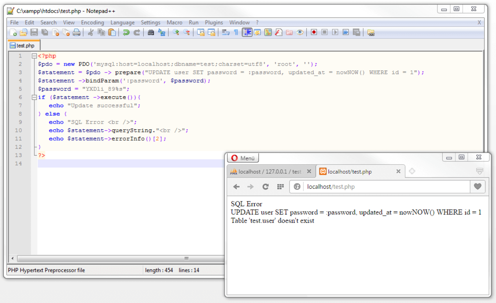

# MySQL

El fundamento de nuestro universo digital es una acumulación de datos que aumenta sin cesar. Como consecuencia, los sistemas de gestión de bases de datos como MySQL son los elementos centrales de Internet y del mundo interconectado. Estos permiten procesar grandes cantidades de datos de manera electrónica, archivarlos con coherencia y guardarlos permanentemente. Para ello, los datos complejos se descomponen en cantidades manejables y, en función de las necesidades, se relacionan entre sí. En nuestro manual de MySQL para principiantes te presentamos los principios básicos de la gestión de bases de datos y te mostramos a través de ejemplos cómo puedes optimizar la gestión de los datos de tu proyecto web con MySQL.

### ¿Qué es MySQL?

MySQL se cuenta junto a Oracle y Microsoft SQL Server entre los sistemas de gestión de bases de datos relacionales más populares a escala mundial (encuentras un listado actual en https://db-engines.com/en/ranking). El software desarrollado en 1994 por la empresa MySQL AB cuenta hoy en día con el patrocinio de Oracle Corporation y se comercializa bajo un sistema de licencias dual. Asimismo, además de la edición Enterprise propietaria, Oracle ofrece una versión de código abierto con una licencia GPL.

Esta licencia dual ofrece a las empresas la posibilidad de desarrollar aplicaciones propias basándose en MySQL sin tener que someterlas a la licencia de código abierto. En la comunidad open source, sin embargo, la absorción de MySQL por parte de Oracle es objeto de críticas.

MySQL está escrito en C y C++ y, además, está provisto de un analizador sintáctico de SQL basado en Yacc con un tokenizador (escáner léxico) propio. Asimismo, el sistema de gestión de bases de datos se destaca por su amplio soporte de sistemas operativos.
La abreviatura SQL procede de “Structured Query Language”, un lenguaje de programación que sirve para gestionar estructuras de bases de datos. Entre las posibles operaciones se encuentran la consulta, integración, actualización y eliminación de datos existentes.

### MariaDB

En el ámbito del desarrollo web, la integración del proyecto MySQL en el catálogo de productos de Oracle es objeto de desconfianza y crítica debido, principalmente, al aumento constante de las diferencias entre la versión MySQL con licencia GPL y el producto Enterprise de pago. Las nuevas funciones del sistema de gestión de bases de datos son cada vez más frecuentes, aunque solo en la versión propietaria. Las bases de datos de errores no públicas y los tests insuficientes hacen suponer a la comunidad que, bajo las alas del software Oracle, el proyecto open source no disfruta de igualdad de condiciones, lo que desencadena un apoyo cada vez menor por parte de esta.

Ya en el año 2009, el equipo de desarrollo principal en torno a Michael “Monty” Widenius, inventor de la base de datos MySQL, le dio la espalda al popular sistema de bases de datos y puso en marcha **con ****MariaDB**** un ****fork**** de código abierto de ****MySQL****.** A finales de 2012, distribuciones Linux como Fedora, OpenSUSE, Slackware y Arch Linux fueron las primeras en reemplazar MySQL por MariaDB como instalación estándar. Un gran número de proyectos open source, de empresas de software y plataformas web conocidas siguieron el mismo ejemplo, entre ellas Mozilla, Ubuntu, Google, Red Hat Enterprise Linux, Web of Trust, Team Speak, la Fundación Wikimedia y XAMPP.

Aún hoy queda patente que, en comparación con la versión de MySQL de código abierto, MariaDB sigue desarrollándose. Por lo tanto, es de suponer que el fork vaya a superar pronto a su proyecto madre.

En el sector del software se puede hablar de un fork como una rama de desarrollo que surge de la bifurcación de un proyecto (en su mayoría, de fuente abierta). Un fork se crea sobre el código fuente del proyecto madre y se desarrolla en un proyecto de seguimiento independiente.

### Sistemas de BD

Hoy en día, la gestión electrónica de datos tiene lugar principalmente con sistemas de bases de datos (SBS), que están formados por dos componentes, la propia base de datos (BD) y el sistema de gestión de la base de datos (SGBD):

El sistema de gestión de bases de datos: por SGBD se entiende todo aquel software que, como MySQL, sirve para gestionar el sistema de bases de datos. Entre las tareas de este software de gestión se encuentra la estructuración de los datos conforme a un modelo de base de datos predefinido. Además, el SGBD controla los accesos de escritura y lectura, administra grandes cantidades de datos y accesos paralelos y se ocupa de que se cumplan las normas con respecto a la integridad de la información, así como a su protección y seguridad.

La base de datos es un conjunto de datos con contenidos relacionados, como, por ejemplo, información de los clientes o datos de los CMS. Un SGBD puede gestionar varias bases de datos de manera simultánea.

Un Sistema de Bases de Datos (SBD) está formado por un Sistema Gestor de Bases de Datos (SGBD) y varias bases de datos (BD)

### Modelo relacional de BD

Según su definición, MySQL es un SGBD relacional. Esto significa que la totalidad de los datos que utiliza MySQL se almacena en tablas relacionadas entre sí por medio de claves (keys).

Veamos cómo se puede ilustrar esto con un ejemplo sencillo. A continuación aparecen las tablas autores y obras:


Todas las tablas de una base de datos relacional están formadas por columnas y filas, y cada columna está diseñada para un **atributo** determinado. En la tabla *autores* se encuentran, por ejemplo, los atributos *id, nombre* y *apellido. *Las filas de una tabla están designadas como **rows****  y cada una de ellas contiene un conjunto de datos, el cual viene identificado (numerado), por lo general, por medio de una **clave primaria**. El tipo de atributo establecido como clave primaria se define a la hora de crear la tabla. El requisito es que la clave primaria posibilite una asignación inequívoca, de modo que esta solo puede utilizarse una vez en la columna. Para ello se recomienda una numeración en serie vía **ID**.

La tabla obras presenta, además de la clave primaria , id_obras, id_autores como clave foránea (foreign key). Esta crea una relación entre ambas tablas y enlaza los conjuntos de datos de una tabla con los de la otra. Cuando se establece una conexión entre dos tablas de una base de datos relacional se puede hablar de un join. Esta conexión podría tener lugar con la siguiente consulta a la base de datos: “carga todas las obras del autor John Ronald Reuel Tolkien con la fecha de la primera publicación”.

Tolkien ha sido clasificado en la tabla autores con la clave primaria id_autores1. Para consultar todas las obras de dicho autor, este se presenta en la tabla obras como clave foránea. De esta manera se solicitan todos los rows enlazados con el id_autores 1.

En la práctica, todas las operaciones de bases de datos en MySQL se llevan a cabo con comandos SQL estandarizados como SELECT, INSERT, UPDATE y DELETE, pero hablaremos de ellos en capítulos posteriores de nuestro manual de MySQL.

Como es lógico, también se pueden guardar todos los datos referentes a los autores y a sus obras en una única tabla. Un almacenamiento de datos de estas características implica que una base de datos contenga un sinnúmero de entradas redundantes, ya que, por ejemplo, los datos en las columnas nombre y apellido se especifican de forma individual para cada obra. Una redundancia de este tipo no solo supone una carga para la memoria, sino que también da lugar a que se tengan que efectuar actualizaciones en diferentes puntos de la base de datos. Es por eso que cuando se trabaja con bases de datos relacionales se limite su contenido a un asunto por tabla. Se habla, en este caso, de una normalización de los datos.

El campo de aplicación principal de MySQL es el almacenamiento de datos en el contexto de las páginas web dinámicas. La combinación de MySQL con el software de servidores web Apache y los lenguajes de script PHP o Perl se ha consolidado como estructura clásica de software en el desarrollo web. El stack web puede llevarse a cabo como LAMP (Linux), MAMP (macOS) o WAMP (Windows) con los sistemas operativos de servidores habituales.

Para los que empiezan a trabajar con MySQL pueden ser recomendables los entornos localesXAMPP para recabar las primeras experiencias con el sistema de gestión de bases de datos, el cual se basa en  MariaDB en la versión actual.

## Instalacion

A continuación, te presentamos algunos ejemplos prácticos para arrojar más luz sobre los fundamentos de MySQL. Nuestro tutorial para MySQL tiene como base el entorno de prueba de XAMPP y los códigos de snippets y las capturas de pantalla se centran en las operaciones de bases de datos que se llevan a cabo a través de PHP con ayuda de un servidor Apache HTTP en un ordenador Windows. En lugar de la clásica base de datos MySQL, en este caso, se aplica el fork MariaDB. Actualmente, ambos sistemas de gestión de bases de datos son tan compatibles que todas las operaciones son exactamente iguales. En el marco de un tutorial para principiantes es indiferente si se trabaja con MySQL o con MariaDB.

También tienes la posibilidad de integrar un stack web personalizado. MySQL y MariaDB se pueden combinar, según sea necesario, con diversos sistemas operativos, servidores web y lenguajes de scripts. Los paquetes de descarga gratuitos y con licencia GPL están disponibles en la página mysql.com y mariadb.com. Puedes obtener instrucciones detalladas de instalación para diferentes plataformas en la documentación en inglés de MySQL y MariaDB.

## Gestion de bases de datos con phpMyAdmin

Para la gestión de MySQL nos basamos en la aplicación web libre phpMyAdmin, contenido en el paquete de instalación de XAMPP, pero también se ofrece por separado en la página web oficial del proyecto como paquete de descarga

phpMyAdmin es considerado como el software estándar para la administración de bases de datos MySQL en la World Wide Web. La aplicación web escrita en PHP y JavaScript facilita las operaciones de bases de datos a través de interfaces gráficas de usuario. De esta manera se pueden crear y gestionar las tablas de la base de datos relacional cómodamente en el navegador web. En este sentido, no es necesario en principio conocer los correspondientes comandos SQL.

### Iniciar phpMyAdmin

Si has instalado XAMPP, inicia el sistema gestor de bases de datos(MySQL o MariaDB) en el panel de control, de la misma forma como se inician los otros componentes del stack. Para ello, utiliza el botón “Start” que hay debajo de “Actions”. Para poder acceder a phpMyAdmin a través del navegador web, es necesario que inicies el servidor web Apache. Los módulos activados aparecen resaltados en color verde en el panel de control de XAMPP. También puedes conocer el estado actual de los módulos de XAMPP en forma de notificación por medio del cuadro de texto.


XAMPP fue desarrollado en el marco del proyecto de software Apache Friends como sistema compacto de pruebas para su uso en ordenadores locales. El paquete de software no está pensado para poner a disposición servicios web en Internet. Como sistema productivo, XAMPP no es apto para el ámbito de la seguridad debido a sus numerosas limitaciones.
En el modo de prueba local, se puede acceder a la interfaz web del software de administración a través de localhost/phpmyadmin/.

Siempre y cuando se haya definido una contraseña para la cuenta root en la instalación de MySQL, será necesario introducirla en la pantalla de registro en phpMyAdmin. En caso de utilizar esta herramienta en un producto de alojamiento web, los datos de registro serán otorgados por el proveedor correspondiente. En este caso, como usuario, no sueles tener derechos de acceso raíz.

Una vez has iniciado sesión, phpMyAdmin muestra la página de inicio de la aplicación, la cual permite realizar los ajustes básicos para obtener el conjunto de caracteres(colación) de la conexión de MySQL o para seleccionar el modo de visualización deseado (idioma, diseño y tamaño de fuente). En la parte derecha aparece un resumen de los datos de referencia de tu servidor de base de datos, del software de servidor web utilizado, así como de la información sobre la versión actual de phpMyAdmin. La barra del menú está, al igual que el resto de barras de menú de la aplicación, diseñada en forma de pestañas. Para seleccionar unas u otras, tan solo hay que hacer clic en Databases, SQL, Status, User accounts, Export, Import, Settings, Replication, Variables y More.


En el extremo izquierdo de la interfaz de usuario aparece un panel de navegación en el que se indican todas las tablas en la base de datos a las que tienes acceso con phpMyAdmin. Bajo el logo del programa en la esquina superior izquierda, hay una función con la que puedes acceder tanto a la página de inicio del software como a la documentación oficial. Además, también existe la posibilidad de configurar el panel de navegación y actualizar su vista.

A continuación comenzamos específicamente con MySQL para que puedas crear tu primera base de datos.

### Crear DB

Para crear una base de datos con phpMyAdmin hay que seleccionar la pestaña “Databases” (bases de datos) en la barra del menú de la página de inicio.


Para crear una base de datos con phpMyAdmin se selecciona la pestaña “Databases”

Introduce un nombre para la base de datos en el campo de entrada bajo “Create database” (crear nueva base de datos) y selecciona un cotejamiento (collation). En este caso es recomendable la colación utf8mb4_unicode_ci. Con ella informamos al servidor de bases de datos sobre la codificación para los datos transmitidos o recibidos. Las variantes mb4 también autorizan signos exóticos como símbolos o emojis, que se escapan a los comandos básicos de Unicode (Basic Multilingual Plane) y, por lo tanto, resultan recomendables.


Confirma la entrada haciendo clic en “Create” (crear). La base de datos creada aparece en el panel de navegación en el lado izquierdo de la pantalla. Las nuevas bases de datos no incluyen ningún contenido. Para depositar datos es necesario que, a continuación, crees una tabla.

### Crear tabla

Para crear una nueva tabla, selecciona la base de datos deseada y navega por la barra de menú hasta llegar a la pestaña “Structure” (estructura).

Crea una tabla e introduce el nombre (por ejemplo, users) y el **número deseado de columnas** mediante el botón “Create table” (generar tabla). Recuerda que a cada columna le corresponde un atributo de la entrada en la tabla. Si necesitas incluir más columnas, lo puedes hacer más tarde.

| Columna | Descripción |
| - | - |
| id | Un número de identificación inequívoco para cada usuario |
| forename | Nombre del usuario |
| surname | Apellidos del usuario |
| email | Dirección de correo electrónico del usuario |
| password | Contraseña del usuario |
| created_at | Fecha en la que se crea la entrada |
| updated_at | Fecha en la que se actualiza la entrada |


Una vez creada la tabla, phpMyAdmin te da la posibilidad de definir los nombres de las columnas y de realizar los ajustes de formato para los datos previstos.


| Opción | Descripción |
| - | - |
| Name | A cada columna en una tabla de una base de datos se le asigna un nombre, el cual puede escogerse libremente, aunque con algunas restricciones. A este respecto, los caracteres del alfabeto latino (mayúsculas o minúsculas, pero sin acentos), los números, el símbolo del dólar y el guion bajo no representan ningún problema. Este se puede usar como alternativa al espacio, que no está permitido (incorrecto: user id; correcto: user_id). Los nombres de las columnas tienen que estar formados por otros símbolos además de números. Asimismo, en el lenguaje para bases de datos SQL se pueden encontrar algunas palabras clave que están reservadas para determinadas tareas. Se puede acceder a una lista de las mismas en la documentación de MySQL. La mayor parte de estas limitaciones pueden eludirse, pero la columna correspondiente siempre debe ir entre comillas simples (`...´). Estas mismas reglas se aplican, entre otros, a los nombres de las tablas en MySQL. Se recomienda optar por nombres de columna elocuentes y que se adapten a los atributos correspondientes. |
| Type | El tipo de datos pone de relieve cuál es la naturaleza de la información que se guarda en una columna. MySQL y MariaDB te permiten definir datos en forma de números enteros o de números de coma flotante, de hora o fecha, así como de cadenas de texto y datos binarios. Se puede encontrar una descripción de los mismos en la tabla de tipos de datos. |
| Length/Values | En algunos tipos de datos (por ejemplo, las cadenas de texto) se puede asignar una longitud máxima a los valores de una columna, aunque este ajuste es opcional. |
| Default | La opción “Default” (por defecto) permite definir un valor estándar para una columna, el cual se inserta automáticamente cuando un conjunto de datos no contiene ningún valor para la columna correspondiente. |
| Collation | La opción “Collation” define un determinado tipo de caracteres para una columna, el cual puede diferir de los ajustes globales de la base de datos. Se puede modificar, además, la codificación en los diferentes niveles de la tabla para todas las columnas. |
| Attributes | Algunos tipos de datos se pueden fijar de una manera más precisa a través de atributos opcionales. Así, con los atributos signed y unsigned se puede establecer, por ejemplo, si los números enteros o los de coma flotante asumen valores positivos (unsigned) o también negativos (signed). |
| Index | A través de la opción “Index” se pueden definir las reglas para la indexación. Si seleccionas el ajuste Index PRIMARY para las columnas, este funciona como clave primaria de la tabla. El ajuste UNIQUE indica que los valores en esta columna solo pueden guardarse una vez, evitando las duplicaciones. |
| A_I | La abreviatura “A_I” hace referencia a AUTO_INCREMENT e indica al gestor de bases de datos que incremente un valor automáticamente cuando no se indique ninguno a la hora de crear una secuencia de datos. Esta opción es de aplicación cuando se indexan conjuntos de datos. |
| Comments | El campo “Comments” integra comentarios en las columnas de la tabla. |

La tabla que aparece a continuación incluye una descripción de la estructura de las tablas así como de los posibles ajustes.

Todas estas opciones comprenden los ajustes más importantes de las columnas de las tablas. Si te mueves hacia la derecha con ayuda de la barra de desplazamiento encontrarás otras posibilidades de configuración —no incluidas en este tutorial de MySQL para principiantes.

La siguiente tabla expone **diferentes tipos de datos** que se pueden procesar tanto con MySQL como con MariaDB, así como su campo de valores y sus requisitos de almacenamiento.

| Tipo | Descripción | Campo de valores | Requisitos de almacenamiento |
| - | - | - | - |
| TINYINT | Un número entero muy pequeño | Sin signos: de 0 a 255 Con signos: de -128 a +127 | 1 byte |
| SMALLINT | Un número entero pequeño | Sin signos: de 0 a 65.535 Con signos: de -32.768 a +32.767 | 2 bytes |
| MEDIUMINT | Un número entero mediano | Sin signos: de 0 a 16.777.215 Con signos: de -8.388.608 a +8.388.607 | 3 bytes |
| INT/INTEGER | Un número entero de tamaño normal | Sin signos: de 0 a 4.294.967.295 Con signos: de -2.147.483.648 a +2.147.483.647 | 4 bytes |
| BIGINT | Un número entero grande | Sin signos: de 0 a 18.446.744.073.709.551.615 Con signos: de -9.223.372.036.854.775.808 a +9.223.372.036.854.775.807 | 8 bytes |
| FLOAT | Un número de coma flotante de simple precisión | Sin signos: de 0 a 3,4e+38 Con signos: -3,4e+38 bis 3,4e+38 | 4 bytes |
| DOUBLE | Un número de coma flotante de doble precisión | Sin signos: de 0 a 3,4e+38 Con signos: de -3,4e+38 a 3,4e+38 | 8 bytes |
| DATE | Fecha en formato 'YYYY-MM-DD' | De '1000-01-01' a '9999-12-31' | 3 bytes |
| TIME | Hora en formato 'HH:MM:SS.ssssss' | De '-838:59:59.999999' a '838:59:59.999999' | 3 bytes |
| DATETIME | Fecha en formato 'YYYY-MM-DD HH:MM:SS.ssssss' | Se corresponde con DATE y TIME (hasta 23:59:59.999999 horas) | 8 bytes |
| TIMESTAMP | Marca temporal en formato 'YYYY-MM-DD HH:MM:DD' | '1970-01-01 00:00:01' (UTC) hasta '2038-01-19 05:14:07' (UTC) | 4 bytes |
| YEAR | Año entre 1901 y 2155 | Desde 1901 hasta 2155 y 0000 | 1 byte |
| CHAR | Cadena de caracteres de longitud fija; el número de caracteres se corresponde con M | Para M: de 0 a 255 caracteres | M byte |
| VARCHAR | Cadena de caracteres de longitud variable; el número de caracteres se corresponde con M | Para M: de 0 a 65.535 caracteres | Máx. M + 2 bytes |
| TINYTEXT | Cadena de caracteres muy pequeña de longitud variable; el número de caracteres se corresponde con M | Para M: de 0 a 255 caracteres | M + 1 byte |
| TEXT | Cadena de caracteres de longitud variable; el número de caracteres se corresponde con M | Para M: de 0 a 65.535 caracteres | M + 2 bytes |
| MEDIUMTEXT | Cadena de caracteres de tamaño medio y longitud variable; el número de caracteres se corresponde con M | Para M: de 0 a 16.777.215 caracteres | M + 3 bytes |
| LONGTEXT | Cadena de caracteres larga de longitud variable; el número de caracteres se corresponde con M | Para M: de 0 a 4.294.967.295 caracteres (4 GB) | M + 4 bytes |
| BLOB | Un BLOB (Binary Large Object) es un objeto binario con datos de longitud variable (p. ej., imágenes, datos de audio). | Máx. longitud de M: 65.535 bytes | M + 2 bytes |
| TINYBLOB | Objeto binario de pequeña envergadura con datos de longitud variable | Máx. longitud de M: 255 bytes | M + 1 byte |
| MEDIUMBLOB | Objeto binario de tamaño medio con datos de longitud variable | Máx. Longitud de M: 16.777.215 bytes | M + 3 bytes |
| LONGBLOB | Objeto binario grande con datos de longitud variable | Máx. longitud de M: 4.294.967.295 bytes (4 GB) | M + 4 bytes |
| ENUM (enumeración) | Un objeto string cuyos valores permitidos se definen al crear la columna | Máx. 65.535 elementos diferentes | 1 o 2 bytes, en función del número de valores posible |
| SET | Un objeto string cuyos valores permitidos se definen al crear la tabla. Es posible hacer una selección múltiple | Máx. 64 valores diferentes | 1, 2, 3, 4, u 8, en función del número de valores posible |

Los posibles valores para la columna *id* se definen como **números enteros** (íntegro, INT) y llevan el atributo *UNSIGNED*. El *id* solo puede adoptar valores numéricos positivos. En “Index” hemos seleccionado el ajuste *PRIMARY* para* id*. A este respecto, el número de identificación hace de **clave primaria** para la tabla *users* y la marca de verificación en “**A_I**” (*Auto_Increment*) indica al sistema gestor de bases de datos que los identificadores de cada entrada tienen que generarse como números consecutivos.

Los valores para las columnas *forename*, *surname*, *email *y *password** *se definen como un tipo de datos *VARCHAR*. Se trata, en este caso, de cadenas de caracteres variables cuya longitud (M) está limitada a 50 caracteres mediante la opción “**Length****/****Value****”. Para la columna *email* se activa el índice *UNIQUE. *De este modo se garantiza que cada dirección de correo electrónico de la tabla se guarde una única vez.

Para las columnas *created_at* y *updated_at* hemos seleccionado el tipo de datos *TIMESTAMP*. El sistema de gestión de bases de datos almacena datos temporales para crear y actualizar las entradas en formato YYYY-MM-DD HH:MM:DD. Puesto que el sistema tiene que generar automáticamente una **marca temporal** para cada entrada, seleccionamos el valor estándar CURRENT_TIMESTAMP *para la columna *created_at**. La columna *updated_at* adquiere importancia cuando se actualiza una entrada. En este sentido, permitimos los **valores Null** para esta columna y se establece *NULL* como valor estándar.

En PHP, el valor NULL representa una entrada vacía, por lo que un campo tiene el valor *NULL* cuando no se le haya asignado ningún valor.


Como motor de almacenamiento se emplea el formato estándar de tabla de MySQL conocido como InnoDB.

phpMyAdmin traduce todos los ajustes que se pueden realizar a una tabla en código SQL y, si es necesario, este puede visualizarse, en “Vista previa de SQL”.


En el capítulo sobre las consultas a las bases de datos te ofrecemos una descripción detallada sobre la sintaxis de SQL.

Los ajustes pueden guardarse haciendo clic en “Save” (guardar). La tabla users se muestra en el panel de navegación de la base de datos bajo la opción test.

### Administrar tablas

Para poder administrar una tabla ya creada, haz clic en el nombre de la tabla en el panel de navegación. Acto seguido, phpMyAdmin te muestra una visión general de los datos guardados en la tabla correspondiente en la pestaña “Browse” (visualizar). En el caso de la tabla del ejemplo, la consulta no genera ningún resultado porque aún no contiene datos.


La barra del menú cuenta con diferentes pestañas para gestionar las tablas de datos. Si quieres modificar la estructura de una tabla de datos, haz clic en la etiqueta “Structure”; para agregar datos selecciona la opción “Insert” (añadir). phpMyAdmin también permite buscar en las tablas, administrar derechos y exportar conjuntos de datos o importarlos de otras tablas.
Si quieres corregir tu tabla posteriormente para incluir columnas adicionales, eliminar las que ya existen o revisarlas, ve a la pestaña “Structure”.

Puedes añadir columnas con la opción “Add columns”, mediante la que puedes indicar el número deseado de columnas nuevas y la posición de las mismas.

En el siguiento gráfico se añade una nueva columna por medio de updated_at:


Si quieres eliminar columnas ya existentes, selecciónalas marcando la casilla correspondiente y haz clic en “Drop”.


La edición de una columna se lleva a cabo a través del botón “Change”. A través de este se te redirige a una vista de edición que se parece a la que se utiliza para la creación de tablas:


En algunas circunstancias, los cambios realizados en la estructura de las tablas pueden conllevar una pérdida de información. Por eso, antes de editar o eliminar las tablas previamente creadas es recomendable que hagas una copia de seguridad de tu base de datos: haz clic en la pestaña “Export” (exportar), selecciona el formato de datos deseado para el backup y confirma el cambio mediante la opción “Go”. A continuación, se abre una ventana de diálogo en la que el navegador web te pide el destino de almacenamiento para la descarga. El programa gratuito **MySQLDumper**es una alternativa a la creación de copias de seguridad de bases de datos con phpMyAdmin.

### Crear entradas de tabla

Para introducir los datos en una tabla vía phpMyAdmin se puede recurrir a dos opciones: o bien se importan conjuntos de datos de un archivo externo (por ejemplo, de una copia de seguridad) o se crean las entradas en la tabla manualmente. Selecciona la tabla de ejemplo users y ve a la pestaña “Insert” (insertar).

phpMyAdmin te muestra la siguiente máscara de entrada de datos:


En el apartado “Column” aparece una lista de las columnas que se han definido para la tabla *users*, y “Type” alberga información sobre el tipo de datos que se espera, así como el número máximo de caracteres entre paréntesis. Omitimos “Function” y pasamos directamente a “Value”, apartado en el cual se definen los valores de cada una de las columnas de la tabla del ejemplo.

En el capítulo anterior se ha configurado la tabla *users* de tal manera que el sistema de gestión de bases de datos provea automáticamente de contenido a los campos de las columnas *id*, *created_at* y *updated_at**. *En la columna *id* se otorga un número de identificación a cada entrada por medio de AUTO_INCREMENT. *Al campo *created_at** *se le asigna de manera automática la fecha actual y a *updated_at** *el sistema le concede el valor estándar *NULL*. Sin embargo, se tienen que introducir los datos de forma manual para las columnas *forename*, *surname*, *email* y *password**, *tal y como se ve a continuación con datos de usuario ficticios:

forename: *John*

surname: *Doe*

email: *john@doe.com*

password: *qwertz*


Pinchando en “Go” los datos se transfieren a la tabla. phpMyAdmin salta automáticamente a la pestaña “SQL” y resume las operaciones realizadas en la base de datos en una sentencia según la sintaxis de SQL:


En principio, todas las operaciones que se llevan a cabo en phpMyAdmin a través de una interfaz gráfica de usuario también pueden escribirse en SQL, lo que forma parte del procedimiento habitual en el marco del desarrollo web.

Las llamadas consultas SQL (SQL queries) se encuentran en el código fuente de todas las aplicaciones web dinámicas y permiten que el servidor web interactúe con la base de datos. El lenguaje de bases de datos SQL se basa en comandos y permite, por ejemplo, consultar y utilizar datos en el marco del funcionamiento del programa. En el siguiente capítulo del presente manual de MySQL te presentamos los comandos SQL más importantes, como por ejemplo SELECT, INSERT, DELETE y UPDATE, y te ofrecemos información sobre la sintaxis de las operaciones de bases de datos básicas.

Pero primero introducimos datos de usuario adicionales en la tabla users y echamos un vistazo a la tabla resultante en la pestaña “Browse”:


### Conexion BD

Tras haber introducido las entradas en la tabla de ejemplo users, en los siguientes capítulos mostramos cómo se pueden solicitar estos datos vía PHP a través del servidor web Apache.

Para ello, el primer paso consiste en crear la conexión con la base de datos. En PHP se puede recurrir a tres interfaces: MySQL Extension, MySQL Improved Extension (MySQLi) y PHP Data Objects (PDO).

MySQL Extension: la extensión MySQL consiste en una interfaz de MySQL hoy obsoleta que fue muy popular en su momento. Frente a MySQLi y PDO, esta versión tiene la desventaja de que no soporta ni sentencias preparadas ni parámetros con nombre.

MySQLi: MySQLi es una versión mejorada de la clásica extensión de PHP para acceder a las bases de datos MySQL. La interfaz trabaja de un modo procedimental, pero también está orientada a objetos. Sin embargo, su utilización es algo limitada en las bases de datos MySQL y Maria DB.

PDO: los PHP Data Objects (PDO) son interfaces orientadas a objetos que dispone una capa de abstracción para acceder a los datos. Así, los PDO no solo permiten la integración de bases de datos MySQL en PHP, sino también de otros sistemas de bases de datos como PostgreSQL, Oracle, MSSQL o SQLite.

A partir de aquí nos concentramos en las **conexiones de bases de datos vía PDO**.

Para poder hacer peticiones a una base de datos con un script de PHP, la base de datos se ha de autentificar en primer lugar. Con la siguiente línea de código se crea una conexión con la base de datos a través de un PDO:


Se recomienda integrarla al principio de cada script que contenga operaciones de bases de datos.

Se utiliza la palabra clave de PHP *new *para crear una instancia de la clase base de PDO, cuyo constructor espera tres parámetros: el **Data ****Source**** ****Name**** (DSN), un nombre de usuario y la contraseña para la base de datos, si la hubiera. En este caso, el DSN está formado por los siguientes parámetros:

controlador PDO para bases de datos:*mysql*

servidor de la base de datos (*****host=*****):*localhost*

*nombre de la base de datos (*****dbname******=):*test*

*colación (*****charset******=):*utf8*

Si todavía no has definido los datos de acceso para tu base de datos, utiliza el nombre de usuario* **root** *y una contraseña vacía:


La conexión con la base de datos se almacena en la variable $pdo. Esto permite remitir a ella posteriormente en el script.

Una vez creada la conexión con la base de datos, se le pueden realizar distintas consultas a medida que se va escribiendo el código en el script. Cuando se finaliza, también se interrumpe la conexión de la base de datos.

### Consultas

Para extraer información de un banco de datos es necesario recurrir al lenguaje de bases de datos SQL, que se basa semánticamente en el inglés y tiene un mantenimiento sencillo. Su sintaxis es, en gran medida, autoexplicativa.

En SQL se trabaja con sentencias, que también se conocen como consultas o preguntas.

Una consulta SELECT sencilla está formada, por ejemplo, por los siguientes componentes:


Primero se define el comando de SQL SELECT y a continuación las columnas y tablas correspondientes a las que hace referencia el comando. Se utiliza un punto y coma para cerrar la sentencia.

Asimismo, tienes la posibilidad de ampliar la sentencia para una condición opcional o para una función de clasificación o de agrupación:

En este sentido se aplica la convención de que, para facilitar la lectura, los comandos de SQL se escriben en mayúscula y los nombres de las bases de datos, de las tablas y de los campos en minúscula. SQL es fundamentalmente un lenguaje sin formato y no hace distinciones entre mayúsculas y minúsculas.

En caso de que recurras a nombres de tabla y de columna que se correspondan con palabras clave de SQL predefinidas (no recomendable), estos deben ir entre comillas simples (' ').

A continuación, ilustramos la sintaxis de sentencias SQL sencillas con ejemplos de los comandos SELECT, INSERT, UPDATE y DELETE.

##### **SELECT**

Se utiliza el comando **SELECT** para consultar series de datos (rows) de un número determinado de tablas. Si se quieren mostrar en el navegador tanto el nombre y los apellidos como las direcciones de correo electrónico de todos los usuarios en la tabla de ejemplo creada con anterioridad, tienes que crear en el directorio htdocs de tu entorno de XAMPP un nuevo archivo PHP text.php e incluir el siguiente script:

```
<?php
$pdo = new PDO('mysql:host=localhost;dbname=test;charset=utf8', 'root', '');
$sql = "SELECT forename, surname, email FROM users";
foreach ($pdo->query($sql) as $row) {
   echo $row['forename'] . " " . $row['surname'] . "<br />";
   echo "E-Mail: " . $row['email'] . "<br /><br />";
}
?>
```

Este ejemplo de código se lee de la siguiente manera: en primer lugar se inicia el script con la etiqueta de inicio de PHP <?php. En la segunda línea se establece la conexión con la base de datos test en localhost y se guarda en la variable $pdo. La sentencia SQL con el comando SELECT se encuentra en la línea 3. En este punto se indica al sistema de gestión de bases de datos que consulte las columnas forename, surname y email de la tabla users. Esta sentencia se guarda en la variable $sql.

Las líneas de la 4 a la 7 muestran el constructor **foreach**, que permite la iteración sobre arrays, lo que significa que una estructura de datos se repasa de forma gradual. Tanto los arrays que se quieren iterar como el modo en que se deben guardar los datos consultados se definen entre comillas detrás del constructor foreach:

```
$pdo->query($sql) as $row
```

La variable $pdo se comunica con la base de datos deseada a través de la conexión definida en la línea 2. Con la función query()y enviamos al banco de datos la sentencia SQL almacenada en la variable $sql.

El servidor web solicita las columnas forename, surname e email de la tabla users de la base de datos test y recorre todas y cada una de las filas de la tabla en el marco del constructor foreach. La palabra clave de PHP as en la variable $row define dónde se tienen que guardar los datos seleccionados.

En la primera ronda del constructor foreach, el array tendría el siguiente aspecto:

```
$row = array (
    forename => John,
    surname => Doe,
    email => john@doe.com
)
```

Una parte del bucle foreach en nuestro ejemplo es la reproducción como texto a cada vuelta del bucle vía echo. Aquí, se repasa cada línea de la tabla, se leen los datos depositados para las columnas definidas en la sentencia SQL y se emiten a través del navegador web.


Si se tienen que leer todas las columnas de una tabla de datos, se debe utilizar el asterisco (*) como espaciador en la secuencia SQL.

```
<?php
$pdo = new PDO('mysql:host=localhost;dbname=test;charset=utf8', 'root', '');
$sql = "SELECT * FROM users";
foreach ($pdo->query($sql) as $row) {
   echo $row['forename'] . " " . $row['surname'] . "<br />";
   echo "E-Mail: " . $row['email'] . "<br />";
   echo "Created at: " . $row['created_at'] . "<br /><br />";
}
?>
```

Con ello se tiene la posibilidad de utilizar todos los datos incluidos en users en el marco del script. En el siguiente screenshot se complementa el texto con la fecha relativa a la creación de la entrada:


En los dos ejemplos anteriores, el servidor web emite datos de usuario en el orden en el que se han introducido en la tabla users (conforme al identificador). Si quieres emitir los datos en otro orden, defínelo con ayuda de la palabra clave de SQL ORDER BY. En el siguiente ejemplo se ofrecen los datos en orden alfabético según el nombre:

```
<?php
$pdo = new PDO('mysql:host=localhost;dbname=test;charset=utf8', 'root', '');
$sql = "SELECT forename, surname, email FROM users ORDER BY forename";
foreach ($pdo->query($sql) as $row) {
   echo $row['forename'] . " " . $row['surname'] . "<br />";
   echo "E-Mail: " . $row['email'] . "<br /><br />";
}
?>
```


Por medio de ORDER BY se pueden obtener los datos en el orden deseado

##### **INSERT**

Rara vez se crean manualmente con phpMyAdmin las entradas de una base de datos. Por lo general, es el servidor web es el que escribe los datos durante la ejecución del script, como ocurre, por ejemplo, cuando un usuario de Internet cumplimenta un formulario online en una página web o deja un comentario en una tienda online. En ambos casos se utiliza el comando de SQL**INSERT** en un segundo plano**.**

Las sentencias SQL con el comando INSERT se crean siguiendo el siguiente esquema:

```
INSERT INTO tabla (columna1, columna 2, columna 3) VALUES (valor1, valor2, valor3);
```

Esto se lee de la siguiente manera: abre la tabla correspondiente e introduce los valores 1, 2 y 3 en las columnas 1, 2 y 3.

Un script PHP sencillo con el que se pueda añadir otra entrada en la tabla de ejemplo users puede tener la siguiente apariencia:

```
<?php
$pdo = new PDO('mysql:host=localhost;dbname=test;charset=utf8', 'root', '');
$sql = "INSERT INTO users (forename, surname, email, password) 
VALUES ('Paddy', 'Irish', 'paddy@irish.com', 'qaywsx')";
if ($pdo->exec($sql) === 1)
  echo "New record created successfully";
?>
```

En primer lugar se crea la conexión con la base de datos y se guarda en la variable $pdo. A continuación, se define la sentencia SQL y se almacena en la variable $sql. En la línea 5 se utiliza el operador flecha (->) para acceder a la variable $pdo y, con ayuda de la función exec(), ejecutar la sentencia SQL almacenada en $sql.

Para garantizar que el script inserte a un conjunto de caracteres en la tabla users, es necesario comprobar el número de las filas implicadas con ayuda de la condición **if****. **Esta se ocupa de que el string New record created successfully solo se emita a través del navegador web cuando la cantidad de conjuntos de datos incluidos sea 1. Si el script vuelve a ejecutarse, el aviso no aparecerá. Las entradas dobles se evitan definiendo como UNIQUE al valor email.


Al acceder a la vista general de la tabla de ejemplo users en la base de datos test se puede observar que la tabla se ha ampliado con la entrada 5. El número de identificación y la fecha se añaden de forma automática según lo previsto.


Puedes obtener un resumen actualizado de tu base de datos a través de phpMyAdmin (el conjunto de datos nuevo aparece destacado en rojo)

##### **UPDATE**

Para actualizar conjuntos de datos ya existentes, se puede recurrir al comando SQL**UPDATE** tal y como se muestra en el siguiente ejemplo:

```
UPDATE table SET column1 = value1, value2 = value2 WHERE column3 = value3
```

Esta sentencia SQL tiene el siguiente significado: selecciona la tabla indicada y reemplaza el valor en la columna1 por el valor1 y el valor en la columna2 por el valor2 siempre y cuando la columna3 tenga el valor3. Si te olvidas de incluir la condición, MySQL sobreescribe estos campos en todos los conjuntos de datos.

En este caso estamos trabajando con una sentencia SQL que vincula una operación a una condición. Si trasladamos esto a la tabla de nuestro ejemplo, la dirección de correo electrónico del usuario John Doe se actualiza por medio del siguiente script de PHP:

```
<?php
$pdo = new PDO('mysql:host=localhost;dbname=test;charset=utf8', 'root', '');
$sql = "UPDATE users 
SET email = 'john.doe@example.com', updated_at = NOW() WHERE id = 1";
if ($pdo->exec($sql) === 1)
  echo "Update successful";
?>
```

En la sentencia SQL definimos que el valor actual en la columna email tenga que ser reemplazado por el valor john.doe@example.com siempre y cuando el valor en la columna contenga el id 1. Por lo tanto, se actualiza el conjunto de datos con la clave primaria 1. Asimismo, también se debe actualizar en la misma sentencia SQL el valor para la columna updated_at con ayuda de la función de MySQL now(), que devuelve la fecha actual. A continuación, se ejecuta la sentencia como antes con la línea de código $pdo->exec($sql) en el contexto de una condición if.


La función NOW() sobreescribe el campo updated_at con la fecha y la hora actuales (la entrada nueva aparece destacada en rojo)

En el ejemplo, hemos actualizado una dirección de correo electrónico y hemos sustituido el valor estándar NULL en la columna updated_at por el registro de fecha y hora. El comando UPDATE permite también transferir valores de una columna a otra. Esta operación puede utilizarse cuando se amplía la tabla users del ejemplo para la columna email_registration, lo que ofrece la posibilidad de diferenciar entre dos direcciones de correo electrónico: una utilizada durante el proceso de registro y otra de contacto actual que se puede modificar con el tiempo. Al principio, no obstante, ambas direcciones son iguales, de modo que se pueden transferir los valores de un campo a otro. Para ello creamos la columna nueva email_registration con phpMyAdmin utilizando “Add columns” en la pestaña “Structure”:


La pestaña “Structure” permite integrar nuevas columnas de tabla en la posición deseada mediante la función “Add columns”

Para transferir los valores se utiliza la sentencia UPDATE siguiente:

```
UPDATE users SET email_registration = email
```

Debido a que se quieren actualizar todos los registros, no hace falta formular ninguna condición para la actualización.

```
<?php
$pdo = new PDO('mysql:host=localhost;dbname=test;charset=utf8', 'root', '');
$sql = "UPDATE users SET email_registration = email";
$affected = $pdo->exec($sql);
echo "$affected rows updated<br>";
?>
```

Si se ejecuta el script en el servidor web, el sistema gestor de bases de datos transfiere los valores de la columna email para todos los conjuntos de datos a la columna email_registration.


El script transfiere todos los valores de la columna email a la columna email_registration y facilita el número de columnas afectadas en el navegador

##### **DELETE**


Las direcciones de correo electrónico de los conjuntos de datos seleccionados se copian de la columna email en email_registration.

Las entradas se pueden eliminar con el comando SQL**DELETE**, que se utiliza siguiendo el esquema que te presentamos a continuación:

```
DELETE FROM tabla WHERE columna = valor
```

Si trabajas con identificadores en tu base de datos, es adecuado identificar con ellos las entradas que vas a borrar. Si, por ejemplo, quieres eliminar la entrada 5 en la tabla del ejemplo, debes proceder de la siguiente manera:

```
<?php
$pdo = new PDO('mysql:host=localhost;dbname=test;charset=utf8', 'root', '');
$sql = "DELETE FROM users WHERE id = 5";
$affected = $pdo->exec($sql);
echo "$affected rows updated<br>";
?>
```

El comando SQL DELETE elimina siempre una fila entera. Si quieres eliminar valores en columnas

determinadas de una base de datos, puedes recurrir a la sentencia UPDATE. Con UPDATE tabla SET columna = NULL WHERE  se le puede asignar el valor NULL a una columna, pero siempre que se haya autorizado dicho valor para la columna correspondiente.

#### **Sentencias preparadas**

Con PDO se pueden realizar operaciones de bases de datos en calidad de sentencias preparadas (prepared statements). En la actualidad, estas “consultas prefabricadas” son una práctica habitual en el desarrollo web y están respaldadas, sobre todo, por todos los sistemas de gestión de bases de datos modernos.

En los ejemplos expuestos con anterioridad hemos transferido directamente valores de parámetro a la sentencia SQL. Los prepared statements, por el contrario, trabajan con marcadores que solo posteriormente se llenan con valores. Esto hace posible que el SGBD pueda comprobar la validez de los parámetros antes de utilizarlos. Las sentencias preparadas ofrecen, siempre y cuando estas se incluyan en el texto fuente, una protección efectiva contra la inyección SQL. En este patrón de ataque, los hackers crean o modifican comandos SQL para acceder a información sensible, transferir datos o aportar los comandos en un sistema.

La inyección SQL se basa en un conocido fallo de seguridad en el entorno de las bases de datos SQL: si se entregan datos de usuario, por ejemplo, vía $_GET con parámetros estáticos, esto permite a los atacantes enriquecer el input con metacaracteres que pueden conducir a efectos indeseados en caso de que estos alcancen al intérprete de SQL sin enmascaramiento. Este método de infiltración puede prevenirse con efectividad por medio de consultas parametrizadas. En este sentido, los prepared statements hacen las veces de plantillas para los comandos SQL que se transmiten a la base de datos separados de los verdaderos parámetros. Esta valida los datos entregados, enmascara los metacaracteres automáticamente e inserta los parámetros en lugar de los marcadores en la secuencia SQL.

Las sentencias preparadas ofrecen, además de seguridad, una ventaja en cuanto a rendimiento. Esta se hace visible cuando el mismo comando SQL se tiene que ejecutar en bucle con diferentes parámetros. Tras ser analizado sintácticamente, la sentencia preparada se introduce en el sistema de base de datos y tiene que ejecutarse con nuevos parámetros. Así, las consultas complejas pueden agilizarse de forma considerable.

En PDO, los prepared statements pueden ejecutarse con ayuda de la función prepare(). Esta prepara una sentencia para la ejecución y devuelve un objeto de secuencia. Como marcador para los valores correspondientes se utiliza o el símbolo de interrogación (?) o un parámetro con nombre (**named**** ****parameter**).

##### **Sentencias preparadas con parámetros sin nombre**

El siguiente ejemplo de código muestra la operación INSERT como sentencia preparada con parámetros sin nombre:

```
<?php
$pdo = new PDO('mysql:host=localhost;dbname=test;charset=utf8', 'root', '');
 
// prepare SQL statement 
$statement = $pdo->prepare("INSERT INTO users (forename, surname, email, password) 
VALUES (?, ?, ?, ?)");
 
// bind parameter 
$statement ->bindParam(1, $forename);
$statement ->bindParam(2, $surname);
$statement ->bindParam(3, $email);
$statement ->bindParam(4, $password);
 
// insert data sets
$forename = "Anders";
$surname = "Andersen";
$email = "anders@andersen.com";
$password = "mnbvc";
if ($statement->execute())
  echo "New record $forename created successfully<br>";
 
$forename = "Matti";
$surname = "Meikäläinen";
$email = "matti@meikäläinen.com";
$password = "jhgfd";
 
 
// display status
if ($statement->execute())
  echo "New record $forename created successfully<br>";
?>
```

Inicialmente se genera un objeto sentencia de la consulta deseada con ayuda de la función prepare() y se guarda en el array $statement. En lugar de valores de parámetro concretos, se utiliza el signo de interrogación como marcador.

Si una sentencia SQL solo contiene marcadores, los valores entregados por separado en el código se han de vincular a la sentencia. En PHP se emplea para ello la función bindParam(). Utilizamos el operador flecha (->) para acceder al método bindParam() del objeto $statement y asignarle variables (1 hace referencia al primer signo de interrogación, 2 al segundo, etc.).

Ahora, la plantilla SQL resultante puede ejecutarse tan a menudo como se desea con los parámetros deseados. En el ejemplo actual se definen los valores de las variables para dos registros. La ejecución de las sentencias SQL prefabricadas tiene lugar para cada entrada mediante execute().

##### **Sentencias preparadas con parámetros con nombre**

Los parámetros con nombre resultan algo más claros que los marcadores con el signo de interrogación. Se trata, en este caso, de marcadores personalizados designados, según las necesidades, por el siguiente esquema:

```
:ejemplo
```

Los parámetros con nombre no pueden contener espacios en blanco o guiones, por lo que en su lugar se tiene que utilizar el guion bajo (_).

El siguiente ejemplo muestra la operación INSERT como sentencia preparada con parámetros con nombre:

```
<?php
$pdo = new PDO('mysql:host=localhost;dbname=test;charset=utf8', 'root', '');
 
// prepare SQL statement
$statement = $pdo->prepare("INSERT INTO users (forename, surname, email, password) 
VALUES (:forename, :surname, :email, :password)");
 
// bind parameter
$statement ->bindParam(':forename', $forename);
$statement ->bindParam(':surname', $surname);
$statement ->bindParam(':email', $email);
$statement ->bindParam(':password', $password);
 
// insert data sets
$forename = "Anders";
$surname = "Andersen";
$email = "anders@andersen.com";
$password = "mnbvc";
 
if ($statement->execute())
  echo "New record $forename created successfully<br>";
 
$forename = "Matti";
$surname = "Meikäläinen";
$email = "matti@meikäläinen.com";
$password = "jhgfd";
$statement->execute();
 
// display status
if ($statement->execute())
  echo "New record $forename created successfully<br>";
?>
```

En la sentencia preparada se encuentran los parámetros con nombre :forename, :surname, :email y :password. Estos se vinculan a las variables $forename, $surname, $email y $password por medio de bindParam(). En el ejemplo actual hemos designado tanto los parámetros como las variables en correspondencia con los nombres de las columnas de la tabla del ejemplo, ya que no es la sintaxis la que lo predetermina. Sí se recomienda utilliar una denominación coherente a favor de un código fuente legible. Tanto la asignación de los valores de las variables como la ejecución de la sentencia SQL se lleva a cabo de forma análoga al ejemplo anterior.

#### **Funciones de fecha y hora en ****MySQL**

MySQL y MariaDB soportan diversas funciones para trabajar con información sobre la fecha y la hora.

| Función de fecha y hora | Descripción |
| - | - |
| CURRENT_TIMESTAMP() / NOW() | En el ejemplo para el comando SQL UPDATE ya has podido conocer la función NOW(), que es sinónimo de la función CURRENT_TIMESTAMP(). Se puede recurrir a ella siempre que, en el marco de una operación de bases de datos, se tenga que mantener la fecha y hora actuales. |
| CURDATE() / CURRENT_DATE() | La función CURDATE() devuelve la fecha actual. |
| CURTIME() / CURRENT_TIME() | La función CURTIME() devuelve la hora actual. |
| DAY() / DAYOFMONTH() | Devuelve el día del mes (0–31); necesita una fecha o marca temporal como argumento |
| DAYOFWEEK() | Devuelve el día de la semana (1 = domingo); necesita una fecha o marca temporal como argumento |
| MONTH() | Devuelve el mes (1–12); necesita una fecha o marca temporal como argumento |
| YEAR() | Devuelve el año (1000–9999, 0); necesita una fecha o marca temporal como argumento |
| DATE() | Extrae la fecha de una fecha u hora dadas; necesita una fecha o marca temporal como argumento |
| TIME() | Extrae la hora de una fecha u hora dadas; necesita una fecha o marca temporal como argumento |
| DATE_FORMAT() | Ajusta una hora o fecha según los parámetros especificados; necesita una fecha o marca temporal como argumento |

Un posible escenario de aplicación para las funciones de fecha y hora son, por ejemplo, las consultas a las bases de datos en las que se tienen que leer todos los conjuntos de datos creados en un día determinado.

El siguiente script emite todos los registros de la tabla users del ejemplo creados hoy:

```
<?php
$pdo = new PDO('mysql:host=localhost;dbname=test;charset=utf8', 'root', '');
$sql = "SELECT forename, surname, email FROM users WHERE DATE(created_at) = CURDATE()";
foreach ($pdo->query($sql) as $row) {
   echo $row['forename'] . " " . $row['surname'] . "<br />";
   echo "E-Mail: " . $row['email'] . "<br /><br />";
}
?>
```

Para mostrar exclusivamente las entradas de hoy se utiliza la siguiente condición en la sentencia SQL:

```
DATE(created_at) = CURDATE()
```

En primer lugar, se extrae la fecha de la marca temporal guardada en la columna created_at con ayuda de la función DATE() y se compara en el siguiente paso con la fecha actual. El comando SELECT solo selecciona las entradas cuya marca temporal coincida con la fecha actual.

Como alternativa puedes seleccionar la entrada actualizada el 17.05.2017, a cuyo efecto hay que adaptar la condición de la sentencia SQL:

```
SELECT forename, surname, email FROM users WHERE DATE(updated_at) = '2016-12-16'
```

En este caso se compara la fecha de referencia con una concreta. Asimismo, se pueden limitar las consultas a un año, mes o día determinados.

La siguiente sentencia hace referencia a todas las entradas de la tabla users creadas en mayo:

```
SELECT forename, surname, email FROM users WHERE month(created_at) = 12";
```

Además de los signos de igualdad, SQL también soporta los siguientes operadores de comparación en las condiciones:

| Operador de comparación | Descripción |
| - | - |
| = | Igual |
| <  | Menor que |
| >  | Mayor que |
| <= | Menor o igual que |
| >= | Mayor o igual que |
| != | No idéntico |

Asimismo, también se pueden vincular varias condiciones con operadores lógicos:

| Operador lógico | Descripción |
| - | - |
| OR o || | O lógico |
| AND o && | Y lógico |

La siguiente sentencia permite, por ejemplo, seleccionar todas las entradas creadas después de febrero y antes de abril:

```
SELECT forename, surname, email FROM users WHERE MONTH(created_at) > 2 AND MONTH(created_at) < 4";
```

| Parámetro | Descripción | Campo de valores/Ejemplos |
| - | - | - |
| %c | Valor numérico para los meses con 1 o 2 cifras | De 0 a 12 |
| %d | Valor numérico para los días del mes con 2 cifras | De 00 a 31 |
| %e | Valor numérico para los días del mes con 1 o 2 cifras | De 0 a 31 |
| %H | Indicador para las horas con 2 cifras | De 00 a 23 |
| %i | Valor numérico para los minutos con 2 cifras | De 00 a 59 |
| %j | Valor numérico para los días con 3 cifras | De 001 a 366 |
| %k | Valor numérico para las horas con 1 o 2 cifras | De 0 a 23 |
| %M | Meses en el esquema regional actual | Enero, febrero, marzo, etc. |
| %m | Valor numérico para los meses con 2 cifras | De 00 a 12 |
| %s | Valor numérico para los segundos con 2 cifras | De 00 a 59 |
| %T | Valores temporales en formato de 24 horas (abreviatura para '%H:%i:%S'. | HH:MM:SS |
| %u | Valor numérico de la semana en el año empezando por el lunes | De 00 a 53 |
| %W | Día de la semana en el esquema regional actual | Lunes, martes, etc. |
| %w | Día de la semana | 0 = domingo, 6 = sábado |
| %Y | Año con 4 cifras | P.ej., 2017 |
| %y | Año con 2 cifras | P.ej., 16 |

#### **Mensajes de error en ****MySQL**

Si un script no se ejecuta como estaba previsto, se pueden presentar errores sintácticos en el código fuente o surgir tablas con nombres, columnas o variables incorrectos. El servidor de bases de datos no emite automáticamente estos mensajes de error, sino que, a menudo, el resultado deseado no se manifiesta sin hacer referencia alguna a la operación fallida.

Con errorInfo(), PDO ofrece una función con la que se pueden recuperar otros datos sobre errores en la última operación realizada en la base de datos, por ejemplo, para emitirlos a través del navegador web.

En el siguiente script de actualización de la dirección de correo electrónico se emplea la función errorInfo() combinada con el constructor if . La condición es la correcta ejecución de la sentencia SQL. Si esta se lleva a cabo como es debido, el servidor web emite el string Update successful. De lo contrario, se ejecuta el código especificado en else.

En el ejemplo, se informa al usuario de que se ha producido un error en SQL y se emite tanto la sentencia SQL correspondiente como información adicional sobre errores por medio de errorInfo():

```
<?php
$pdo = new PDO('mysql:host=localhost;dbname=test;charset=utf8', 'root', '');
$statement = $pdo -> prepare("UPDATE user SET password = :password, updated_at = NOW() WHERE id = 1");
$statement ->bindParam(':password', $password);
$password = "YXDli_89%s";
if ($statement ->execute()){
   echo "Update successful";
} else {
   echo "SQL Error <br />";
   echo $statement->queryString."<br />";
   echo $statement->errorInfo()[2];
}
?>
```

Si el script se ejecuta a través del servidor web, se obtiene la siguiente información:

```
SQL Error 
UPDATE user SET password = :password, updated_at = NOW() WHERE id = 1
Table 'test.user' doesn't exist
```

El comando SQL UPDATE hace referencia a una tabla con el nombre user. La tabla de nuestro ejemplo se llama users. El servidor SQL no es capaz de encontrar la tabla solicitada y ofrece el mensaje Table 'test.user' doesn't exist. El motivo del fallo ha sido un error tipográfico en la sentencia SQL que se corrige con facilidad.

En cuanto a los valores de retorno de la función errorInfo(), se puede hablar de un array con tres elementos:

[0] = código de error SQL

[1] = código de error específico del controlador

[2] = mensaje de error específico del controlador

La información a la que se accede a través de errorInfo() puede definirse indicando los elementos deseados entre corchetes.



Entrega de información de errores a través del navegador web

En la práctica, no es muy común que el navegador web entregue información detallada sobre los errores, pues no sirven de nada a los usuarios. Por el contrario, los atacantes potenciales pueden utilizar estos mensajes de error para seguir a las consultas SQL y encontrar las debilidades de las aplicaciones. Por esto, es recomendable que la información general dada a los usuarios acerca de los fallos sea muy general y que la información referente a los mismos se almacene de manera interna.

Esto podría lograrse como se muestra a continuación:

```
<?php
$pdo = new PDO('mysql:host=localhost;dbname=test;charset=utf8', 'root', '');
$statement = $pdo->prepare("UPDATE user SET password = :password, updated_at = NOW() WHERE id = 1");
$statement->bindParam(':password', $password);
$password = "YXDli_89%s";
if ($statement->execute()) {
   echo "Update successful";
} else {
  echo “Unfortunately an error has occurred during the updating of your password. Please contact our administrator on: admin@website.com.”;
  $error = DATE("Y-m-d H:i:s") . " - " . __FILE__ . " - " . $statement->queryString . " - " . $statement->errorInfo()[2] . " \r\n";
  file_put_contents("sqlerrors.log", $error, FILE_APPEND); 
}
?>
```

En lugar de emitir el valor de retorno de la función errorInfo() a través de echo en el navegador web, se guarda junto con la marca temporal actual, la ruta del archivo y la sentencia SQL en la variable $error.

La funciónPHP*DATE**(**)*ofrece la marca temporal de Unix en el formato especificado. La llamada constante mágica __FILE__ entrega la ruta completa para el archivo test.php. Solicitamos la sentencia SQL actual al igual que en el ejemplo anterior vía $statement->queryString. Por último, se almacenan los datos guardados en $error con ayuda de la función file_put_contents() como texto en el archivo sqlerrors.log en la carpeta htdocs.


#### **JOIN**

Como ya se ha mencionado en el capítulo sobre las bases de datos relacionales, se pueden consultar datos de diferentes bases de datos simultáneamente. Si ya estás familiarizado con las operaciones básicas de bases de datos, volveremos a recurrir a ellas para demostrar cómo se pueden vincular las diferentes tablas de tu base de datos en un join (en español, unión o conexión).

La combinación de las tablas de una consulta tiene lugar con ayuda del comando SQL JOIN. Aquí se vinculan dos o más tablas normalizadas por medio de columnas enlazadas, lo que se puede llevar a cabo a través de una clave foránea.

A continuación, te demostramos cómo se enlazan las tablas de bases de datos con el siguiente ejemplo:


La tabla muestra una selección de algunas de las canciones más famosas de los años 60 y puede servir como ejemplo negativo de un mal diseño de bases de datos.

A primera vista llama la atención el hecho de que la tabla muestre gran cantidad de datos redundantes. Estos se eliminan y  distribuyen en el marco de la normalización en tablas separadas y se combinan entre sí con ayuda de claves foráneas.

##### **Formas normales**

Un buen diseño de bases de datos se distingue por tener un mínimo de redundancia. Sin embargo, deben evitarse las entradas dobles a través de la normalización de las tablas de datos. En el marco del modelo de bases de datos relacional se han establecido tres formas normales complementarias que establecen reglas fijas para una estructuración de datos óptima.

###### **Primera forma normal**

Una tabla se corresponde con la primera forma normal cuando todos los valores de los atributos son atómicos. Se entiende por valores de atributo atómicos aquellos que solo contienen información, lo que se puede observar claramente en nuestro ejemplo negativo.

Observemos, por ejemplo, las columnas album_title e interpret de la tabla album. En lugar de incluir cada dato de la tabla en una columna diferente, lo hemos hecho más fácil y hemos introducido datos relativos al año de publicación del álbum, así como de la existencia de la banda entre paréntesis detrás del título del álbum o de los datos del intérprete. Este descuido se hace evidente cuando, por ejemplo, se quieren consultar todos los títulos publicados en un año determinado.

En este caso, es recomendable crear tablas de datos siguiendo las reglas de la primera forma normal. En la tabla de nuestro ejemplo esto tendría el siguiente aspecto:


Los datos aparecen separados y pueden leerse sin problemas. Asimismo, la tabla sigue conteniendo redundancias, como antes. Sigue leyendo y te explicaremos cómo puedes eliminarlas.

###### **Segunda forma normal**

Una tabla está en segunda forma normal cuando se cumplen todas las condiciones de la primera forma normal y cada atributo que no forme parte de la totalidad de la clave primaria de la tabla es independiente funcionalmente.

A menudo, hay tablas de datos que contienen una columna que funciona como clave primaria. Las tablas de este tipo se corresponden automáticamente con la segunda forma normal si se cumplen las condiciones de la primera forma normal. En ocasiones puede suceder que la clave primaria de una tabla aparezca en dos columnas, tal y como ocurre en la tabla del ejemplo.

Para obtener el título deseado de la columna title de la tabla title se necesita, por un lado, el album_id y por otro el número del título en la columna track. Se puede obtener el título Sympathy for the Devil, por ejemplo, por medio de la clave primaria album_ID = 3 AND track = 1, por lo que en este caso se puede hablar de una clave primaria compuesta. Esta es necesaria para las consultas referidas a la columna title. Las columnas album_title, released, interpret y years_active dependen de album_id. Sin embargo, para estas columnas no existe ninguna dependencia funcional con respecto a la totalidad de las claves primarias. No se cumplen, por tanto, las condiciones de la segunda forma normal.

Esto puede modificarse colocando la columna title en una tabla nueva y vinculándola mediante una clave foránea (album_id) con la tabla de salida:


La tabla album revisada solo contiene una clave primaria y cumple automáticamente las condiciones de la segunda forma normal. La nueva tabla title contiene la columna sin clave title, que es, a nivel funcional, totalmente dependiente de ambas partes de la clave primaria (album_id y track) y se corresponde, así, con la segunda forma normal.

En la segunda forma normal, la tabla de datos album también contiene entradas redundantes.

###### **Tercera forma normal**

Si una tabla se corresponde con la tercera forma normal, deben cumplirse todas las condiciones de la segunda forma normal y de la primera forma normal. Además, se debe comprobar que ningún atributo no clave dependa de forma transitiva de un atributo clave. Puede que esta condición parezca muy complicada, pero se puede explicar en pocas palabras: se da una dependencia transitiva siempre que un atributo no clave dependa de otro atributo no clave.

Precisamente esto es lo que se aplica a la tabla album del ejemplo. Aquí se encuentran las columnas interpret y years_active. Mientras que se puede identificar al intérprete por medio de album_id, el año de formación de la banda depende tanto de los intérpretes como, a nivel transitivo, del album_id. Esto tiene como desventaja que cada vez que se añada un álbum nuevo a un intérprete que ya se ha mencionado, el sistema de gestión de bases de datos guarda automáticamente un valor redundante en la columna years_active.

Para cumplir las condiciones de la tercera forma normal y eliminar todas las redundancias de nuestra tabla, se deben incluir las columnas interpret y years_active en una tabla separada y vincularlas con la tabla de salida album mediante la clave foránea (interpret_id).

Así, se obtienen tres tablas normalizadas: interpret, album y title.


Si se quiere transmitir un título determinado en nuestra base de datos, además de la información sobre el álbum y el intérprete, estas deben estar combinadas entre sí en tres tablas separadas con ayuda del comando JOIN y de la clave foránea correspondiente.

##### **Definición de claves foráneas a través de phpMyAdmin**

Si eliges el motor de bases de datos [InnoDB](https://www.ionos.mx/digitalguide/hosting/cuestiones-tecnicas/que-es-innodb/), puedes definir cómodamente relaciones de claves foráneas a través de la interfaz gráfica del software de administración phpMyAdmin. Asimismo, la clave primaria de una tabla puede utilizarse como clave foránea en muchas otras tablas.

En nuestro ejemplo se requieren dos conexiones para enlazar las tres tablas normalizadas album, interpret y title:

Para la primera conexión se utiliza la clave primaria album_id de la tabla album como clave foránea en la tabla title.

Para la segunda conexión se utiliza la clave primaria interpret_id de la tabla interpret como clave foránea en la tabla album.

Las relaciones de las claves foráneas pueden contemplarse en el siguiente gráfico:

A la hora de establecer el vínculo entre las tablas de datos una columna que funciona como clave foránea debe contener los atributos UNIQUE o INDEX.

La relación entre lasclaves primarias y las foráneas se corresponde, por lo general, con la relación del tipo 1:n. Cada campo de datos en la columna clave primaria de la tabla A está relacionado con varios campos de datos (n) en la columna clave foránea de la tabla B. Cada campo de datos en la columna clave foránea de la tabla B hace referencia a un campo de datos de la columna clave primaria de la tabla A. Como ejemplo, en la columna de clave primaria album_id de la tabla album hay cuatro entradas vinculadas a través de la clave foránea title.album_id con las ocho entradas de la tabla title.


Para establecer las relaciones deseadas, creamos las tablas album, interpret y title en phpMyAdmin y definimos nuestras claves primarias en el marco de la creación de la tabla como ya se ha indicado a través de la opción “Index”. Es recomendable tener en cuenta aquí el hecho de que las columnas que funcionarán posteriormente como claves foráneas se tienen que marcar como INDEX o UNIQUE mediante la opción Index. Para las relaciones 1:n solo es apto INDEX, puesto que los valores en el campo UNIQUE no deben repetirse.

A continuación se definen las claves foráneas. Para ello, regresa a la tabla album del ejemplo. Elige la tabla en el panel de navegación y haz clic en la pestaña Structure en la barra de menú, que contiene el botón “Relation view” (vista de la relación):

Las relaciones de claves foráneas se definen en la vista de relaciones de las tablas de datos por medio del campo de entrada “Foreign key constraints”:


En la tabla album, la columna interpret_id debe funcionar como clave foránea, que se basa en la clave primaria interpret_id de la tabla interpret.

Por lo tanto, se debe seleccionar la columna interpret_id como clave foránea en el menú desplegable bajo “Column”. Ten en cuenta que aquí solo se especifican columnas marcadas como INDEX, UNIQUE o PRIMARY. En el campo de entrada triple “Foreign key constraint (InnoDB)” se debe especificar en qué clave primaria, de qué tabla y en qué base de datos debe basarse la clave foránea. Para ello, realiza la siguiente selección:

base de datos: test

tabla: interpret

clave primaria: interpret_id

El campo “Constraint name” puede quedarse vacío, aunque el sistema de gestión de bases de datos le otorga un nombre automáticamente. Sin embargo, debe definirse el modo en que se comporta una tabla con claves foráneas en cuanto la clave primaria subyacente para la clave foránea se modifique o se elimine.

Si, por ejemplo, se elimina un intérprete de la tabla padre interpret, también desaparece la clave primaria relacionada con dicha entrada. Se trata, por lo tanto, de determinar lo que debe pasar con las entradas relacionadas con esta entrada por medio de una clave foránea, lo que en nuestro ejemplo se refiere a los álbumes de un intérprete.

Para determinar el comportamiento de una tabla con claves foráneas en caso de que se den las opciones UPDATE o DELETE, tanto en MySQL como en MariaDB se puede recurrir a cuatro opciones.

**RESTRICT:** la opción RESTRICT impide la modificación de la tabla padre siempre que existan otras tablas que remitan a esta. En el ejemplo que presentamos en nuestro tutorial para aprender a usar MySQL, no se puede eliminar un conjunto de datos en la tabla *interpret* si hay conjuntos de datos en la tabla *album* que estén ligados a esta.

**CASCADE:** la opción CASCADE se ocupa de que se transmita el cambio realizado en la tabla padre al resto de tablas que referencian a dicha tabla padre. Si, por ejemplo, cambiamos el *interpret_id* del intérprete *The Rolling Stones* de 2 a 8, mediante la opción de clave foránea CASCADE este cambio se aplicará a todas las tablas. Si se elimina una entrada en la tabla padre, esto da lugar, además, a que todos los conjuntos de datos vinculados se eliminen de las otras tablas. Es recomendable prestar atención al hecho de que la eliminación de una única entrada puede conllevar la desaparición de numerosos conjuntos de datos.

**SET NULL:** si seleccionas la opción SET NULL, se le asignará NULL al valor en la columna de clave foránea cuando se modifique o elimine la clave primaria en la tabla padre.

**NO ACTION:** en MySQL, la opción NO ACTION equivale a la opción RESTRICT.

Una vez definida la opción deseada para la relación de claves foráneas, haz clic en “Save” para confirmar la entrada. El sistema de gestión de bases de datos otorga un nombre de forma automática a la nueva relación.


Todas las relaciones de claves foráneas definidas están especificadas bajo “Foreign key constraints” en la pestaña “Structure”

##### **Tipos de JOIN en MySQL y MariaDB**

Las relaciones de claves foráneas te permiten acceder a los datos de diferentes tablas con una única sentencia SQL. Para ello, puedes recurrir a cuatro tipos de JOIN en MySQL y MariaDB:

INNER JOIN: con INNER JOIN, el sistema de bases de datos busca entradas comunes en tablas enlazadas con JOIN. Solo se leen los conjuntos de datos que guardan coincidencias entre sí, es decir, en los que los valores de las columnas enlazadas (de clave primaria y clave foránea) de ambas tablas coinciden.

OUTER JOIN: con OUTER JOIN se pueden establecer diferencias entre tablas de datos situadas a la izquierda o a la derecha. A diferencia de INNER JOIN, no solo se leen los conjuntos de datos que coinciden entre sí en ambas tablas, sino también todos los conjuntos de datos restantes de las tablas de la derecha y de la izquierda.

LEFT JOIN: se leen todos los conjuntos de datos de la tabla izquierda y de la derecha en los que se encuentran coincidencias.

RIGHT JOIN: se leen todos los conjuntos de datos de la tabla derecha y de la izquierda en los que se encuentran coincidencias.

En este tutorial de MySQL nos centramos en INNER JOIN.

La sintaxis de INNER JOIN sigue el siguiente esquema:

```
SELECT * FROM tabla1
INNER JOIN tabla2 ON tabla1.clave foránea = tabla2.clave primaria
WHERE columna = valor
```

El comando SELECT combinado con el marcador * indica al sistema de gestión de bases de datos que lea los valores de todas las columnas para los que son de aplicación la condiciones de las cláusulas ON y WHERE.

Puesto que en este caso se habla de INNER JOIN, solo se extraen de la base de datos los conjuntos de datos en los que existan coincidencias entre la clave foránea de la tabla1 y la clave primaria de la tabla2. Además, se puede definir una función de filtro opcional con ayuda de la cláusula WHERE.

Te aclaramos esto a continuación con un ejemplo basado en nuestras tablas normalizadas album, interpret y title:

```
<?php
$pdo = new PDO('mysql:host=localhost;dbname=test;charset=utf8', 'root', '');
$sql = "SELECT * FROM album
INNER JOIN interpret ON album.interpret_id = interpret.interpret_id";
foreach ($pdo->query($sql) as $row) {
   echo $row['album_title'] . " was released by " . $row['interpret'] . " in " . $row['released'] . ".<br /><br />";
}
?>
```

El script del ejemplo muestra una operación INNER JOIN en la que la tabla album está relacionada con la tabla interpret y se seleccionan los conjuntos de datos en los que se da una coincidencia entre la clave primaria y la foránea.

```
album.interpret_id = interpret.interpret_id
```

Nuestra base de datos recoge todos los conjuntos de datos (un LEFT o RIGHT JOIN tendría el mismo resultado). A continuación se generan los valores leídos con ayuda de un bucle foreach y de la construcción del lenguaje echo en el navegador.

El script de ejemplo muestra todos los álbumes existentes en la base de datos, además del intérprete y del año de la primera publicación

En el marco de una sentencia SQL, se extraen los datos del intérprete de la tabla interpret y los relativos al título del álbum y al año de publicación del disco que aparecen en la tabla album.

La decisión de los conjuntos de datos del join que deben visualizarse viene delimitada con una condición en la cláusula**WHERE**. Si, por ejemplo, se quiere acceder a los álbumes publicados en el año 1968, se puede proceder de la siguiente manera:

```
<?php
$pdo = new PDO('mysql:host=localhost;dbname=test;charset=utf8', 'root', '');
$sql = "SELECT * FROM album
INNER JOIN interpret ON album.interpret_id = interpret.interpret_id WHERE released = 1968";
foreach ($pdo->query($sql) as $row) {
   echo $row['album_title'] . " was released by " . $row['interpret'] . " in " . $row['released'] . ".<br /><br />";
}
?>
```

Mediante la condición WHERE released = 1968 se limita dicha emisión en el navegador a un solo álbum. Beggars Banquet de los Rolling Stones es el único álbum en nuestra todavía base de datos abarcable que se publicó en el año 1968.


Con la condición en la cláusula WHERE se restringe la salida de un conjunto de datos

Con ayuda del comando JOIN se pueden unir varias tablas en una red de datos. En el ejemplo siguiente se combina la tabla album en un INNER JOIN con las tablas interpret y title para arrojar información completa sobre los títulos musicales almacenados en la base de datos.

```
<?php
$pdo = new PDO('mysql:host=localhost;dbname=test;charset=utf8', 'root', '');
$sql = "SELECT * FROM album
INNER JOIN interpret ON album.interpret_id = interpret.interpret_id 
INNER JOIN title ON album.album_id = title.album_id";
foreach ($pdo->query($sql) as $row) {
   echo $row['title'] . " was released by " . $row['interpret'] . " as Track " . $row['track'] . " on " . $row['album_title'] . " in " . $row['released'] . ".<br /><br />";
}
?>
```


Con el comando SQL JOIN se puede enlazar un gran número de tablas de datos

De ser necesario, es posible definir una cláusula WHERE con una función de filtrado. Un ejemplo de ello es si se quiere emitir información sobre la pista 7 del álbum “Abbey Road”.

```
<?php
$pdo = new PDO('mysql:host=localhost;dbname=test;charset=utf8', 'root', '');
$sql = "SELECT * FROM album
INNER JOIN interpret ON album.interpret_id = interpret.interpret_id 
INNER JOIN title ON album.album_id = title.album_id WHERE track = 7 AND album_title = 'Abbey Road'";
foreach ($pdo->query($sql) as $row) {
   echo $row['title'] . " was released by " . $row['interpret'] . " as Track " . $row['track'] . " on " . $row['album_title'] . " in " . $row['released'] . ".<br /><br />";
}
?>
```


INNER JOIN con dos condiciones enlazadas por medio del operador AND lógico

Es recomendable prestar atención al hecho de que en la tabla title nos enfrentamos a una clave primaria múltiple. Si se quiere hacer referencia a un título determinado, además del número de la pista, se necesita el album_id que aparece en la tabla junto al título del álbum.

**Conclusiones**

Este material de MySQL para principiantes está concebido como un curso intensivo que explica los fundamentos sobre los sistemas de bases de datos basados en SQL y presenta ejemplos de interés práctico de sencillas operaciones de bases de datos. Si la información expuesta sobre las posibilidades de la aplicación objeto de la presente guía es de tu interés, también puedes consultar la documentación enlazada en el capítulo introductorio sobre los sistemas de gestión de bases de datos MySQL y MariaDB. Asimismo, Internet también alberga gran cantidad de páginas web que ofrecen tutoriales y ejemplos de uso sobre el popular sistema de gestión de bases de datos.

Es recomendable, asimismo, visitar la plataforma online Stack Overflow, en la que una amplia comunidad de usuarios formada por más de 6,5 millones de desarrolladores intercambian información y hablan de los problemas relativos al desarrollo del software.

